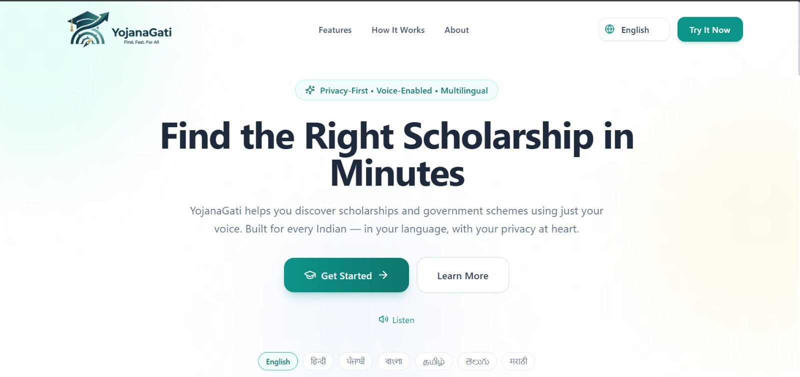
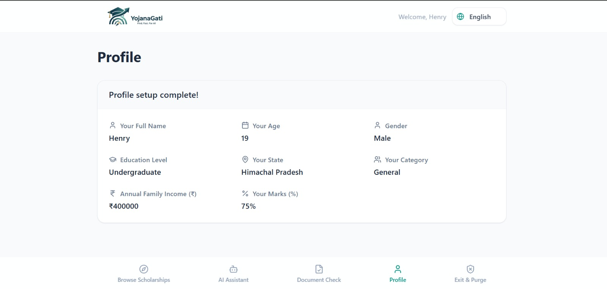
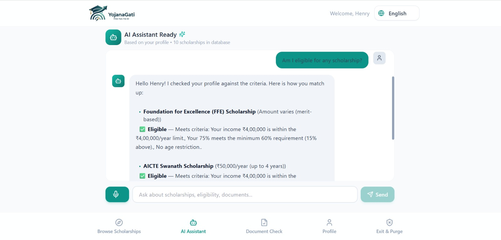
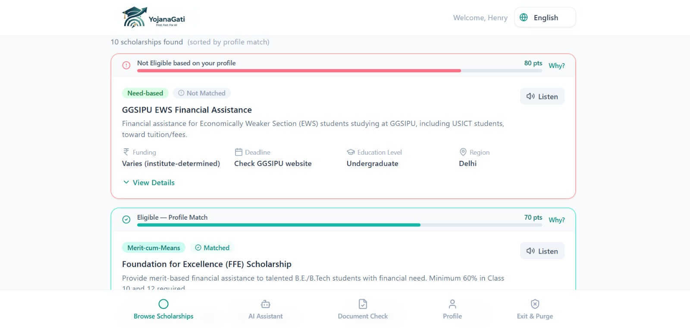

<div align="center">


# YojanaGati (योजनागति) 🎓

**Your Gateway to Scholarships and Government Schemes — Voice-Enabled, Privacy-First, and Multilingual.**

[](#-license)
[](https://react.dev/)
[](https://www.typescriptlang.org/)
[](https://vitejs.dev/)
[](https://supabase.com/)
[](#-contributing)

</div>

<div align="center">

</div>

YojanaGati is a modern web application designed to help Indian students discover and apply for matching scholarships and government schemes. Built with a focus on accessibility and strict privacy, YojanaGati lets students navigate, speak, search, and verify eligibility in their native language, with a strong guarantee of zero data retention.

---

## 📑 Table of Contents

- [Screenshots](#-screenshots)
- [Key Features](#-key-features)
- [Tech Stack](#️-tech-stack)
- [Project Directory Layout](#-project-directory-layout)
- [Database Schema & Security](#️-database-schema--security)
- [Getting Started](#-getting-started)
- [Privacy Guarantee Summary](#️-privacy-guarantee-summary)
- [Contributing](#-contributing)
- [License](#-license)

---

## 📸 Screenshots

<!-- Drop your screenshots into a /screenshots or /public folder and swap the paths below -->
<div align="center">

| Profile | Chat / Voice Assistant | Browse Scholarships |
|:---:|:---:|:---:|
|  |  |  |

</div>


---

## 🌟 Key Features

### 1. 🎤 Multilingual Voice-First Design
* **7 Indian Languages Supported**: Adapt the entire application layout, text, and voice interaction to **English, Hindi (हिन्दी), Punjabi (ਪੰਜਾਬੀ), Bengali (বাংলা), Tamil (தமிழ்), Telugu (తెలుగు), and Marathi (मराठी)**.
* **Text-to-Speech (TTS) & Speech-to-Text (STT)**: Integrated voice buttons let students speak questions and hear responses aloud, powered by browser-native `webkitSpeechRecognition` and `SpeechSynthesis` engines.

### 2. 🔒 Privacy-First (Zero Data Retention)
* **Ephemeral Sessions**: Built on a custom session hook (`useEphemeralSession`), all user data—including uploaded certificates, parsed fields, and chat histories—exists only in temporary, in-memory React state.
* **Auto-Purge & Safety Locks**:
  * All sensitive files (Base64 data URLs) and OCR analyses are immediately nulled and garbage-collected upon session exit.
  * Automatic purge occurs after **15 minutes of inactivity** or if the page/browser is closed/reloaded (`beforeunload`).
  * A developer-facing verification utility (`verifyPurge`) asserts that no active pointers to PII remain in memory.

### 3. 📄 Smart Document Verification & OCR
* **Client-Side Tesseract.js**: Upload files (Aadhaar, Income Certificates, Marksheets, Caste/Domicile/Disability Certificates) and perform optical character recognition (OCR) directly inside a browser Web Worker via WASM. **Image bytes never leave the local machine.**
* **Automatic Aadhaar Masking**: A regex safeguard detects and masks 12-digit Aadhaar sequences to `XXXX-XXXX-LAST4` in raw extracted text before storing it in any application state.
* **Inconsistency Detection**: Cross-references OCR-extracted details (e.g., student name, annual family income, board marks) against the user's profile to warn them of potential application discrepancies.

### 4. 🤖 Local AI RAG Matching Engine
* **Hallucination-Free Recommendations**: Rather than making expensive external LLM API calls, YojanaGati uses a local rule-based Retrieve-and-Generate (RAG) engine that scores and checks hard eligibility conditions (income limits, academic criteria, state domicile, gender, caste category) directly against a curated Postgres scholarship directory.

<details>
<summary><b>📊 Feature comparison at a glance</b></summary>

| Feature | Description | Runs Where |
|---|---|---|
| Voice Interaction | STT/TTS in 7 Indian languages | Browser (Web Speech API) |
| Document OCR | Extracts & masks sensitive fields | Browser (Tesseract.js / WASM) |
| Eligibility Matching | Rule-based scoring against scholarship DB | Local RAG engine |
| Data Storage | Scholarship directory, read-only | Supabase (Postgres + RLS) |
| Session Data | Certificates, chat history, parsed fields | In-memory only, auto-purged |

</details>

---

## 🛠️ Tech Stack

* **Core Framework**: [React 18](https://react.dev/) + [TypeScript](https://www.typescriptlang.org/) + [Vite](https://vitejs.dev/)
* **Styling**: [Tailwind CSS](https://tailwindcss.com/) + [PostCSS](https://postcss.org/) + [Lucide React](https://lucide.dev/) (Icons)
* **Client-Side OCR**: [Tesseract.js](https://tesseract.projectnaptha.com/) (WASM)
* **Database & BaaS**: [Supabase](https://supabase.com/) (PostgreSQL with Row Level Security)
* **Voice Engines**: Native Web Speech API (`SpeechRecognition` & `SpeechSynthesis`)

---

## 📁 Project Directory Layout

```text
YojanaGati/
├── .bolt/                  # Bolt configuration
├── public/                 # Static assets (logos, icons)
├── screenshots/             # App screenshots for docs/README
├── supabase/
│   └── migrations/         # PostgreSQL schema and security policy migrations
├── src/
│   ├── components/         # Reusable UI controls (LanguageSelector, ScholarshipCard, VoiceButton)
│   ├── hooks/              # Custom React state hooks (useEphemeralSession, useSpeech)
│   ├── lib/
│   │   ├── documentAnalysis.ts  # Client-side OCR parsing, Aadhaar masking, cross-checks
│   │   ├── eligibility.ts       # Hard/soft eligibility ranking engine (income, marks, age, category)
│   │   ├── i18n.ts              # Localized translations for 7 languages
│   │   ├── rag.ts               # Local semantic retrieval and query generation rules
│   │   ├── scholarshipsData.ts  # Curated fallback scholarship directory (offline-friendly)
│   │   ├── supabase.ts          # Supabase client instantiation
│   │   └── types.ts             # TypeScript interface and type declarations
│   ├── views/              # Main view templates (Browse, Chat, Documents, Onboarding, Purge)
│   ├── App.tsx             # Root application orchestrator
│   ├── main.tsx            # React application mount point
│   └── index.css           # Global Tailwind styles
├── index.html              # Single Page Application entry point
├── package.json            # Scripts and dependencies configuration
├── tailwind.config.js      # Tailwind theme styling parameters
└── tsconfig.json           # TypeScript configuration
```

---

## 🗄️ Database Schema & Security

The project uses a Supabase-backed table `scholarships` containing pre-vetted scholarship offerings. Security policies ensure public read access is enabled (`anon` access) while write operations are prohibited on the client side:

```sql
CREATE TABLE IF NOT EXISTS scholarships (
  id uuid PRIMARY KEY DEFAULT gen_random_uuid(),
  name text NOT NULL,
  name_hindi text,
  description text NOT NULL,
  category text NOT NULL,
  eligibility_criteria text NOT NULL,
  required_documents text[] NOT NULL DEFAULT '{}',
  funding_amount text NOT NULL,
  deadline text NOT NULL,
  min_income text,
  min_percentage integer,
  education_level text NOT NULL DEFAULT 'Any',
  provider text NOT NULL,
  region text NOT NULL DEFAULT 'All India',
  keywords text[] NOT NULL DEFAULT '{}',
  created_at timestamptz DEFAULT now()
);

-- Row Level Security (RLS) policies
ALTER TABLE scholarships ENABLE ROW LEVEL SECURITY;
CREATE POLICY "anon_read_scholarships" ON scholarships FOR SELECT TO anon, authenticated USING (true);
```

> 💡 **Graceful Fallback**: If Supabase credentials are missing or the user is offline, YojanaGati seamlessly falls back to `src/lib/scholarshipsData.ts` to power the app locally.

---

## 🚀 Getting Started

### 📋 Prerequisites
Make sure you have [Node.js](https://nodejs.org/) installed (v18+ recommended).

### ⚙️ Installation
Clone this repository and install project dependencies:
```bash
git clone https://github.com/simrangupta8920-spec/YojanaGati.git
cd YojanaGati
npm install
```

### 🔑 Environment Variables
Create a `.env` file in the root directory to configure live Supabase fetch operations:
```env
VITE_SUPABASE_URL=your_supabase_project_url
VITE_SUPABASE_ANON_KEY=your_supabase_anon_key
```

### 💻 Running Locally
To launch the Vite hot-reloading development server:
```bash
npm run dev
```
Open [http://localhost:5173](http://localhost:5173) in your web browser.

### 🏗️ Building for Production
To compile and optimize your project for production:
```bash
npm run build
```

### 🔍 Verification & Linting
Run static analysis checks:
```bash
# Code Style Linting
npm run lint

# TypeScript Compilation Check
npm run typecheck
```

---

## 🛡️ Privacy Guarantee Summary

1. **Local OCR Processing**: File uploads are parsed locally in browser memory via WASM workers. **None of your files are sent to any remote server.**
2. **Instant PII Scrubbing**: Aadhaar numbers are immediately replaced with `XXXX-XXXX-LAST4` inside local variables before being committed to any React state.
3. **Session Purging**: Exiting the session or closing the tab completely wipes all session state from the client device.

---

## 🤝 Contributing

Contributions are welcome! To get started:

1. Fork the repository
2. Create a feature branch (`git checkout -b feature/amazing-feature`)
3. Commit your changes (`git commit -m 'Add amazing feature'`)
4. Push to the branch (`git push origin feature/amazing-feature`)
5. Open a Pull Request

Please run `npm run lint` and `npm run typecheck` before submitting a PR.

---

## 📄 License

<!-- Update this if your license differs -->
This project is licensed under the **MIT License**. See the [LICENSE](./LICENSE) file for details.

---

<div align="center">

Made with ❤️ for students across भारत

</div>
